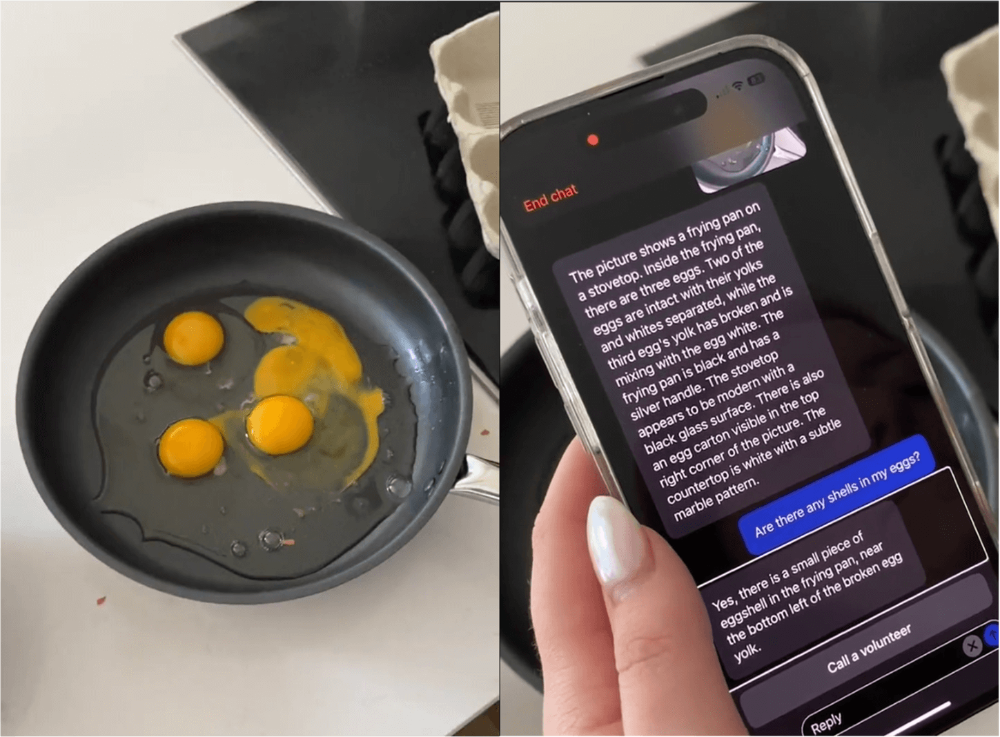

# Dataset

This dataset contains Be My AI-generated image descriptions shared by visually-impaired users on four social media platforms.

| # | Platform  | Description | Screenshot | Date Posted | Date Access | Original Link |
|---|-----------|------------|------------|-------------|-------------|--------------|
| 1 | Reddit    | The picture shows an outdoor scene at night with various Christmas decorations. In the foreground, there is a brightly lit Christmas tree adorned with yellow lights. To the left of the tree, there is a green illuminated structure that looks like a stylized tree made of light tubes. There are also other trees wrapped with colorful string lights in the background. Buildings with lit windows can be seen, and the sky is dark, indicating it's nighttime. There's a tower in the distance with red and blue lights at the top. People are walking around the area, enjoying the festive atmosphere. The ground appears to be wet, possibly from recent rain. | N/A | 2023-12 | 2024-04-15 | Available upon request |
| 2 | Reddit    | "In the picture that you send me is your current bloodsugar level 189 mg/dl. This is higher then the normal value between 70 and 140 mg/dl it should be. To retrieve the asked timeslots I need to interprete the graphic of the app. This is not 100% perfect but I will try to help you.  Your bloodsugar level 3 hours ago was about 230 mg/dl. This is much higher than the normal value.  Your bloodsugar level 2 hours ago was about 210 mg/dl and this is still too high than the normal level.  Your bloodsugar level 1 hour ago was about 190 mg/dl. This is a bit lower then previous value but still higher then the normal level.  Like you can see is your bloodsugar level the last few hours lower but not low enough to be in range with the normal value. I want to ask you to contact your nurse or doctor for advice about how you can lower your bloodsugar and keep it under control. It's very important to check at regular base the bloodsugar level and to keep following your diet and keep to do some sports. I hope I was able to help you!" | N/A | 2023-10 | 2024-04-15 | Available upon request |
| 6 | X | The picture shows a frying pan on a stovetop. Inside the frying pan, there are three eggs. Two of the eggs are intact with their yolks and whites separated, while the third egg's yolk has broken and is mixing with the egg white.The frying pan is black and has a silver handle. The stovetop appears to be modern with a black glass surface, There is also an egg carton visible in the top right corner of the picture. The countertop is white with a subtle marble pattern.    [follow-up]: Are there any shells in my eggs?   Yes, there is a small piece of eggshell in the frying pan, near the bottom left of the broken egg yolk. |  | 2023-09-25 | 2024-04-15 | Available upon request |
| 6 | X | The picture shows a frying pan on a stovetop. Inside the frying pan, there are three eggs. Two of the eggs are intact with their yolks and whites separated, while the third egg's yolk has broken and is mixing with the egg white.The frying pan is black and has a silver handle. The stovetop appears to be modern with a black glass surface, There is also an egg carton visible in the top right corner of the picture. The countertop is white with a subtle marble pattern.    [follow-up]: Are there any shells in my eggs?   Yes, there is a small piece of eggshell in the frying pan, near the bottom left of the broken egg yolk. |  | 2023-09-25 | 2024-04-15 | Available upon request |
