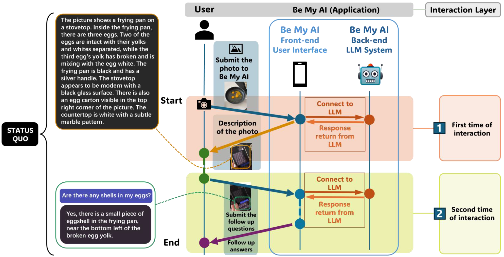

<p align="center">
<h1 align="center"><strong>Beyond Visual Perception: Insights from Smartphone Interaction of Visually Impaired Users with Large Multimodal Models</strong></h1>
<h3 align="center">CHI 2025</h3>

<p align="center">
    <a href="https://sites.google.com/view/jingyixie/">Jingyi Xie</a><sup>1</sup>,</span>
    <a href="https://ruiyu0.github.io/">Rui Yu</a><sup>2</sup>,
    <a href="https://he-zhang.com/">He Zhang</a><sup>1</sup>,
    <a href="https://ist.psu.edu/directory/skb5969">Syed Masum Billah</a><sup>1</sup>,
    <a href="https://scholar.google.com/citations?user=R_OvcWwAAAAJ/">Sooyeon Lee</a><sup>3</sup>,
    <a href="https://jcarroll.ist.psu.edu/">John M Carroll</a><sup>1</sup>
    <br>
        <sup>1</sup>Pennsylvania State University,
        <sup>2</sup>University of Louisville,
        <sup>3</sup>New Jersey Institute of Technology
</p>

<p align="center">
  
</p>


Large multimodal models (LMMs) have enabled new AI-powered applications that help people with visual impairments (PVI) receive natural language descriptions of their surroundings through audible text. We investigated how this emerging paradigm of visual assistance transforms how PVI perform and manage their daily tasks. Moving beyond basic usability assessments, we examined both the capabilities and limitations of LMM-based tools in personal and social contexts, while exploring design implications for their future development. Through interviews with 14 visually impaired users and analysis of image descriptions from both participants and social media using Be My AI (an LMM-based application), we identified two key limitations. First, these systems' context awareness suffers from hallucinations and misinterpretations of social contexts, styles, and human identities. Second, their intent-oriented capabilities often fail to grasp and act on users' intentions. Based on these findings, we propose design strategies for improving both human-AI and AI-AI interactions, contributing to the development of more effective, interactive, and personalized assistive technologies.


## Dataset

In this work, we collected a dataset containing Be My AI-generated image descriptions shared by visually-impaired users on four social media platforms. See [details of the dataset](DATASET.md).


## Citation
```
@inproceedings{xie2025beyond,
  title={Beyond Visual Perception: Insights from Smartphone Interaction of Visually Impaired Users with Large Multimodal Models},
  author={Xie, Jingyi and Yu, Rui and Zhang, He and Billah, Syed Masum and Lee, Sooyeon and Carroll, John M},
  booktitle={Proceedings of the CHI Conference on Human Factors in Computing Systems},
  year={2025}
}
```
